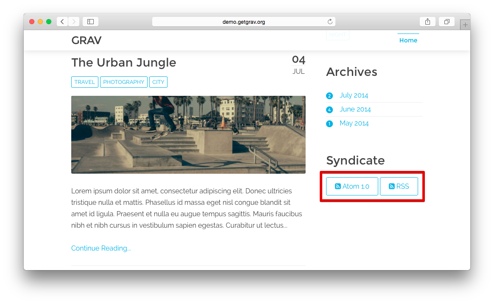

# Grav Syndication Feed Plugin



`feed` is a [Grav](http://github.com/getgrav/grav) plugin and allows Grav to generate feeds of your pages.

This plugin supports __Atom 1.0__, __RSS__ and __JSON__ feed types. Enabling is very simple. just install this plugin in the `/user/plugins/` folder in your Grav install. By default, the plugin is enabled and provides some default values.

| NOTE: JSON feeds must be enabled manually in the plugin configuration as the `.json` extension is commonly used and this can conflict with other plugins.

# Installation

Installing the Feed plugin can be done in one of two ways. Our GPM (Grav Package Manager) installation method enables you to quickly and easily install the plugin with a simple terminal command, while the manual method enables you to do so via a zip file. 

## GPM Installation (Preferred)

The simplest way to install this plugin is via the [Grav Package Manager (GPM)](http://learn.getgrav.org/advanced/grav-gpm) through your system's Terminal (also called the command line).  From the root of your Grav install type:

    bin/gpm install feed

This will install the Feed plugin into your `/user/plugins` directory within Grav. Its files can be found under `/your/site/grav/user/plugins/feed`.

## Manual Installation

To install this plugin, just download the zip version of this repository and unzip it under `/your/site/grav/user/plugins`. Then, rename the folder to `feed`. You can find these files either on [GitHub](https://github.com/getgrav/grav-plugin-feed) or via [GetGrav.org](http://getgrav.org/downloads/plugins#extras).

You should now have all the plugin files under

    /your/site/grav/user/plugins/feed

>> NOTE: This plugin is a modular component for Grav which requires [Grav](http://github.com/getgrav/grav), the [Error](https://github.com/getgrav/grav-plugin-error) and [Problems](https://github.com/getgrav/grav-plugin-problems) plugins, and a theme to be installed in order to operate.

# Usage

The feeds work for pages that have sub-pages, for example a blog list view. If your page has a `content`, then the RSS plugin will automatically be enabled. Simply append either `.atom`, `.rss` or `.json` to the url.  For example, if you have a blog page that defines a `content` header to display a list of blog pages in a list, and the URL is `http://www.mysite.com/blog` then the feed would simply be:

```
http://www.mysite.com/blog.atom
```

or

```
http://www.mysite.com/blog.rss
```

or

```
http://www.mysite.com/blog.json
```
## Creating Feed Buttons in Your Pages

Just having the plugin loaded and activated is enough to get it working, but you can help users find your feeds by creating buttons in the body of your page users can easily discover and click on to access the feeds.

In our [Blog Skeleton] demo, you will see these buttons located in the sidebar under the heading `Syndicate`. This was done very easily by adding the following information to the `sidebar.html.twig` template file found under `/user/themes/antimatter/templates/partials/`.

```
<a class="button" href="{{ base_url }}.atom"><i class="fa fa-rss-square"></i> Atom 1.0</a>
<a class="button" href="{{ base_url }}.rss"><i class="fa fa-rss-square"></i> RSS</a>
```

The first line adds the **Atom** feed by simply adding `.atom` to the base URL of the site, while the second handles RSS. This a very simple way to add a useful feature to your site that your visitors will enjoy.

# Config Defaults

```
enable_json_feed: false
limit: 10
description: My Feed Description
lang: en-us
length: 500
```

You can override any of the default values by setting one or more of these in your blog list page where `sub_pages` is defined. For example:

```
title: Sample Blog
content:
    items: @self.children
    limit: 5
    pagination: true
feed:
    limit: 15
    description: Sample Blog Description
```

You can ensure a particular page is skipped from the feed by adding the following in the frontmatter header:

```
title: Sample Blog
feed:
    skip: true
```

# Updating

As development for the Feed plugin continues, new versions may become available that add additional features and functionality, improve compatibility with newer Grav releases, and generally provide a better user experience. Updating Feed is easy, and can be done through Grav's GPM system, as well as manually.

## GPM Update (Preferred)

The simplest way to update this plugin is via the [Grav Package Manager (GPM)](http://learn.getgrav.org/advanced/grav-gpm). You can do this with this by navigating to the root directory of your Grav install using your system's Terminal (also called command line) and typing the following:

    bin/gpm update feed

This command will check your Grav install to see if your Feed plugin is due for an update. If a newer release is found, you will be asked whether or not you wish to update. To continue, type `y` and hit enter. The plugin will automatically update and clear Grav's cache.

## Manual Update

Manually updating Feed is pretty simple. Here is what you will need to do to get this done:

* Delete the `your/site/user/plugins/feed` directory.
* Downalod the new version of the Feed plugin from either [GitHub](https://github.com/getgrav/grav-plugin-feed) or [GetGrav.org](http://getgrav.org/downloads/plugins#extras).
* Unzip the zip file in `your/site/user/plugins` and rename the resulting folder to `feed`.
* Clear the Grav cache. The simplest way to do this is by going to the root Grav directory in terminal and typing `bin/grav clear-cache`.

> Note: Any changes you have made to any of the files listed under this directory will also be removed and replaced by the new set. Any files located elsewhere (for example a YAML settings file placed in `user/config/plugins`) will remain intact.

