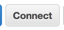
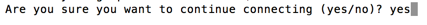
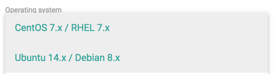
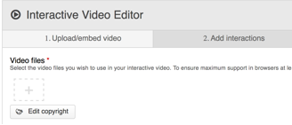
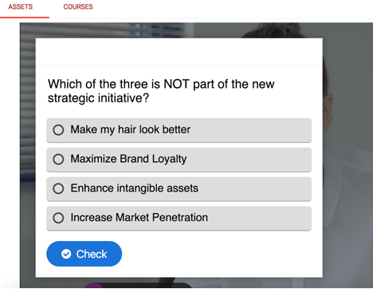
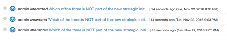

<html>
<body>
[This was originally posted at](http://drdavefusco.com/installing-elmsln-on-aws-and-configuring-xapi-and-h5p/)

  
Installing ELMSLN on AWS and configuring xAPI and H5P
  

  
I've had the privilege recently of meeting the good people of <a href="http://elmsln.org/" target="_blank">ELMSLN</a> and learning of the great things they are doing to advance new ed tech tools and solutions.
  

  
The purpose of this post is to walk through the steps I took to install an ELMS instance on AWS as well as configure it to post <a href="http://tincanapi.com/" target="_blank">xAPI</a> statements from an interactive <a href="http://h5p.org/" target="_blank">H5P</a> video, and post it to my own <a href="http://en.wikipedia.org/wiki/Learning_Record_Store" target="_blank">LRS</a> instance from <a href="http://learninglocker.net/" target="_blank">Learning Locker</a>. As a side note, my LRS is also on AWS - if you want to see how to do that, check out this <a href="http://www.youtube.com/watch?v=51Dci7B49xA&amp;t=642s" target="_blank">video</a> from <a href="http://www.knanthony.com/" target="_blank">K. Anthony.</a>
  

  
Step 1. I'm going to assume you already have an AWS account. If not, <a href="http://www.googleadservices.com/pagead/aclk?sa=L&amp;ai=DChcSEwj9sp_hyr3QAhUEHGkKHbDLDn4YABAA&amp;ohost=www.google.com&amp;cid=CAESIeD2808kZtPusuEZ3bgW5m0jhpfN9-i2k13tkxAv-vyFGg&amp;sig=AOD64_0xjWXH9KpBZK895ouzlBr2Wdi0mg&amp;q=&amp;ved=0ahUKEwjC3Zrhyr3QAhUE04MKHb29CNsQ0QwIGw&amp;adurl=" target="_blank">check this out.</a>
  

  
Step 2. Inside your 'EC2 Dashboard', click 'Launch Instance'
  

  

  

  
Step 3. Set up an Ubuntu instance; I chose all free tier for mine, but you can select more CPU, RAM, disk space as needed.&nbsp; After selecting Ubuntu 14, you can go directly to 'Review and Launch' OR configure each stage for more resources, as needed.
  

  

  

  

  

  
Step 4.&nbsp; Scroll down a bit and choose 'Edit security groups'
  

  
Click 'Add Rule' and select HTTP; also 'Add Rule' and select HTTPS
  

  
As a side note, if you are storing any kind of sensitive data and want to protect your resources, you'll want to change the 0.0.0.0/0 subnet to your liking.&nbsp; This is NOT a firewall in any shape or form - it only restricts traffic by a given subnet to your instance.
  

  
Step 5.&nbsp; Click 'Review and Launch' and then 'Launch'
  

  

  

  
Step 6. &nbsp;Select your public/private key combo that you'll need to SSH into your server.&nbsp; I already had one, which I used, but you can <a href="http://docs.aws.amazon.com/AWSEC2/latest/UserGuide/ec2-key-pairs.html">learn how to do it here</a>.&nbsp; After this, click 'Launch Instances'
  

  

  

  
Step 7.&nbsp; Go back to your EC2 Management Console, where you'll see your instance 'Initializing'.&nbsp; Once that completes (Under 'Status Checks', the hourglass and 'Initializing' will change to '2/2 checks passed')
  

  
Step 8.&nbsp; Select your instance on the left (check the check box next to your instance); you can also name it by clicking on the pencil, next to the ID
  

  

  

  
Step 9.&nbsp; Click 'Connect'
  

  

  

  

  

  
Step 10.&nbsp; A pop-up box will appear; under 'Example', you'll want to copy the ssh command (entire line) and then paste that into your shell (terminal or command line, etc.);&nbsp;
  

  
NOTE: You'll need to have your key .pem file located in the same directory where you'll be running this command.&nbsp; It will ask if you want to add this fingerprint.&nbsp; Say yes.&nbsp; OR say no and go do something outside.
  

  
ssh -i "keyfile.pem" ubuntu@ec2-##-###-#-##.us-west-2.compute.amazonaws.com
  

  

  

  
Step 11.&nbsp; I'm not sure if this step is absolutely necessary, but I tried running this command via sudo and it didn't like it; so I changed the root password and su in before I ran it.
  

  
$ sudo passwd root
     SOMESAFEPASSWORD (twice)
  

  
$ su
  

  
Enter this command below; you'll want to generate your own, depending on your domain, subdomain, etc. settings you'll want; you can <a href="https://rawgit.com/elmsln/install-builder/master/install.html">do that here</a>
  

  
<a href="https://rawgit.com/elmsln/install-builder/master/install.html">https://rawgit.com/elmsln/install-builder/master/install.html</a>
  

  
Make sure you choose Ubuntu from the OS list; the rest is up to you
  

  

  

  
# apt-get update &amp;&amp; apt-get -y install wget git &amp;&amp; git clone https://github.com/elmsln/elmsln.git /var/www/elmsln &amp;&amp; bash /var/www/elmsln/scripts/install/handsfree/ubuntu14/ubuntu14-install.sh LearnerView LV drdavefusco.com http admin@drdavefusco.com yes
  

  
cd $HOME &amp;&amp; source .bashrc
  

  

  

  
As my kids would say, 10 years later…&nbsp; Just kidding; mine took like 10 minutes to run; just let it do its thing
  

  

  

  

  

  

  

  

  

  

  

  
Step 12.&nbsp; Note some important information once it's done:
  

  
In green, copy the username: admin and corresponding password: PASSWORD
  

  
_&nbsp; username: admin&nbsp;&nbsp;&nbsp;&nbsp;&nbsp;&nbsp;&nbsp;&nbsp;&nbsp; &nbsp;&nbsp;&nbsp;&nbsp;&nbsp;&nbsp;&nbsp;&nbsp;&nbsp;&nbsp;&nbsp;&nbsp;&nbsp;&nbsp;&nbsp;&nbsp;&nbsp;&nbsp;&nbsp;&nbsp;&nbsp;&nbsp;&nbsp;&nbsp;&nbsp;&nbsp;&nbsp;&nbsp;&nbsp;&nbsp;&nbsp;&nbsp;&nbsp;&nbsp;&nbsp;&nbsp;_
  

  
_&nbsp; password: password&nbsp;&nbsp;&nbsp;&nbsp;&nbsp;&nbsp;&nbsp;&nbsp;&nbsp;&nbsp;&nbsp;&nbsp;&nbsp;&nbsp;&nbsp;&nbsp;&nbsp;&nbsp;&nbsp;&nbsp;&nbsp;&nbsp;&nbsp;&nbsp;&nbsp;&nbsp;&nbsp;&nbsp;&nbsp;&nbsp;&nbsp;&nbsp;&nbsp;&nbsp;&nbsp;&nbsp;&nbsp;&nbsp;&nbsp;&nbsp;&nbsp;&nbsp;
  

  

  

  
Step 13.&nbsp; At this point, you'll need to either:
  

  <ol style="list-style-type:lower-alpha;"><li>Copy the information into your local HOSTS file OR</li><li>Create corresponding A records for your domain, so that others can access your site</li>
  </ol>
  
Since this step can be a lot different, depending on your domain/subdomain setup, hosting options, DNS, etc. I'm not going to provide instructions here on how to do this.&nbsp; Please check with your domain name hosting provider on how to create the necessary A records for those provided to you from the install (e.g. people, courses, innovate, etc.).&nbsp; For me, I exported my zone file, added the necessary records, and then imported the zone file back.
  

  

  

  
Step 14.&nbsp; Go to your site - e.g. lor.domain.name; log in using the admin password generated
  

  
Your ELMSLN is ready to go!&nbsp; IF you're interestd in xAPI and H5P, keep reading
  

  

  

  
Step 15.&nbsp; Go into your LRS and get your endpoint, username, and password used for accepting xAPI statements
  

  
Back on your instance, edit the following file and modify it to correspond to your LRS settings:
  

  
/var/www/elmsln/config/shared/drupal-7.x/settings/shared_settings.php
  

  
No need to restart anything, at least not that I Found.
  

  

  

  
Step 15.&nbsp; Go <a href="https://h5p.org/update-all-content-types">HERE</a> and download the latest (all) H5P content types - one file
  

  
<a href="https://h5p.org/update-all-content-types">https://h5p.org/update-all-content-types</a>
  

  
Step 16.&nbsp; Go to here on your site /admin/content/h5p and browse to upload the you just downloaded from the previous step.&nbsp; This will allow access to the content types supported from H5P
  

  
Step 17.&nbsp; Add new H5P content - I did a video; go to your site /node/add/h5p-content
  

  <ol style="list-style-type:lower-alpha;"><li>Select a course (assumed you already created one on this site)</li><li>Give it a title</li><li>Content Type - 'Interactive Video'</li><li>Click the + under 'Video Files'</li>
  </ol>
  

  

  <ol style="list-style-type:lower-alpha;"><li value="5">Paste in a URL from the video source and click 'Insert'</li><li value="6">Select 'Add Interaction's from the second tab (seen above)</li><li value="7">I chose to do a multiple choice quiz - drag this icon to a place in the video where you want to stop and ask the user to take a quiz
    <ol style="list-style-type:lower-alpha;"><li>You can chose how you want the behavior to act - e.g. force a stop, force a 100% score before watching the rest of the video, etc.&nbsp; There's lots of <a href="https://h5p.org/interactive-video">help at H5P here</a></li>
    </ol></li>
  </ol>
  
Step 18.&nbsp; Once a user interacts with the video, it will generate xAPI statements, which you can confirm on your LRS
  

  

  

  

  

  

  

  
NOTE: You can also see data on your site here /elmsln/course-data
  

  

  

  

  

  

  

</body>
</html>